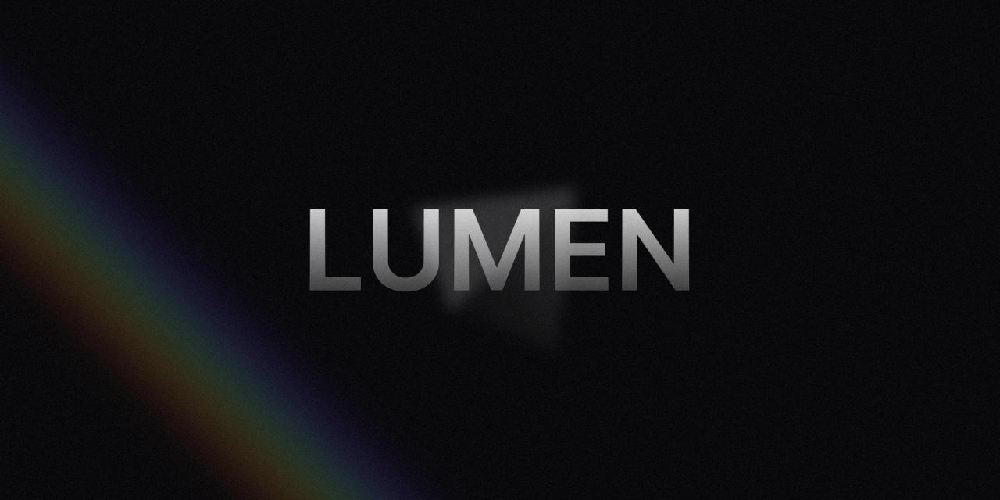

# 🌈 Lumen

Lumen - це мобільний додаток для керування світлодіодним кільцем на основі NeoPixel, що працює на базі мікроконтролера ESP8266. Додаток дозволяє легко перемикатися між вбудованими режимами, змінювати кольори, швидкість анімації та інші параметри в реальному часі.

👉 [Прошивка ESP8266](https://github.com/Malberee/lumen-firmware)

# ⚡ Технології

Розроблено з використанням власноруч портованної бібліотеки компонентів [NextUI (нині HeroUI)](https://github.com/Malberee/nextui-native) 