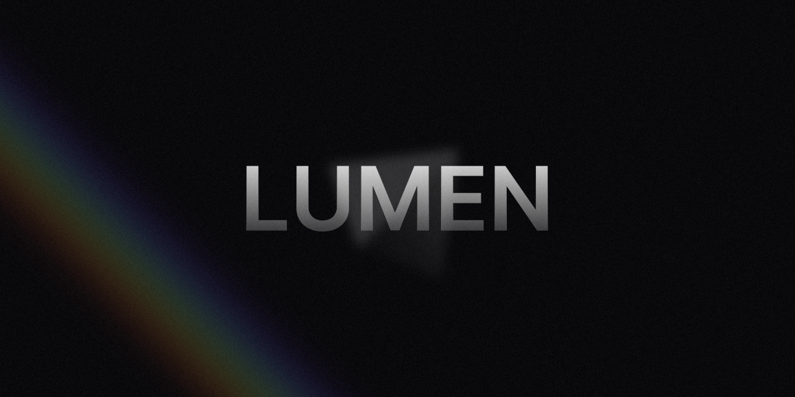

<h1 align="center">🌈 Lumen</h1>

Lumen - це мобільний додаток для керування світлодіодним кільцем на основі NeoPixel, що працює на базі мікроконтролера ESP8266. Додаток дозволяє легко перемикатися між вбудованими режимами, змінювати кольори, швидкість анімації та інші параметри в реальному часі.

<a href="https://github.com/Malberee/lumen-firmware">👉 Прошивка ESP8266</a>

<h1 align="center">⚡ Технології</h1>

 
 

Розроблено з використанням власноруч портованної бібліотеки компонентів <a href="https://github.com/Malberee/merlo-ui">MerloUI</a>

