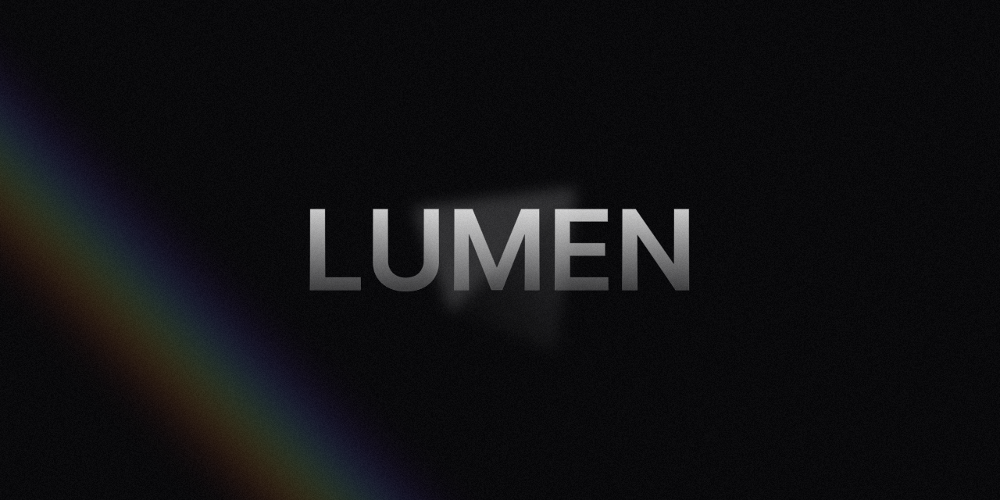

# 🌈 Lumen

Lumen is a mobile application for controlling a NeoPixel-based LED ring powered by an ESP8266 microcontroller. The app allows you to easily switch between built-in lighting modes, change colors, animation speed, and other parameters in real time.

👉 [Firmware ESP8266](https://github.com/Malberee/lumen-firmware)

# ⚡ Технології

Developed using a custom ported component library [NextUI](https://github.com/Malberee/nextui-native) (now HeroUI)